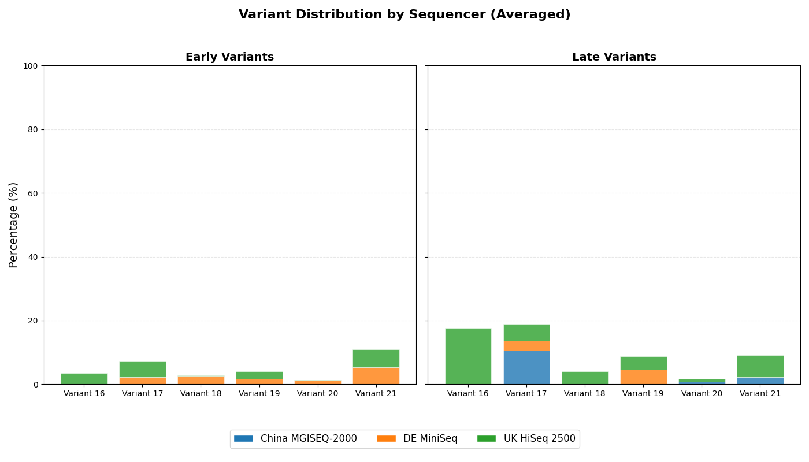

# Cancer Gene Variant Visualization

This repository contains Python code for analyzing and visualizing variant frequencies in cancer-associated genes. The project generates stacked bar plots to highlight the distribution of genetic variants across different genes from tumor samples.

Developed as part of a Summer 2025 internship focused on cancer genomics and data visualization.

---

## Table of Contents

* [Overview](#overview)
* [Data](#data)
* [Installation](#installation)
* [Usage](#usage)
* [Example Plots](#example-plots)
* [Requirements](#requirements)
* [License](#license)

---

## Overview

Genetic variants in key oncogenes and tumor suppressor genes play a critical role in cancer development and progression. This project analyzes mutation data and provides a clear, visual representation of the frequency and distribution of these variants across samples using stacked bar charts.

---

## Data

The project assumes input data in CSV format containing:

* `Gene`: Name of the gene
* `Variant_Type`: Type of variant (e.g., missense, nonsense, frameshift)
* `Sample_ID`: (Optional) Unique identifier for each sample
* `Variant_Count`: (Optional) Number of variants (if summarized data)

**Example (simplified):**

| Gene | Variant\_Type | Count |
| ---- | ------------- | ----- |
| TP53 | Missense      | 35    |
| TP53 | Nonsense      | 10    |
| KRAS | Missense      | 25    |

You may need to adapt the input format depending on your dataset.

---

## Installation

1. Clone the repository:

   ```bash
   git clone https://github.com/umarawais84/cancer-gene-variant-analysis.git
   cd cancer-gene-variant-visualization
   ```

2. (Optional) Create and activate a virtual environment:

   ```bash
   python -m venv venv
   source venv/bin/activate  # On Windows use: venv\Scripts\activate
   ```

3. Install required packages:

   ```bash
   pip install -r requirements.txt
   ```

---

## Usage

Place your CSV data file in the project directory. Then, run:

```bash
python plot_variants.py --input your_data.csv --output variant_plot.png
```

**Arguments:**

* `--input`: Path to input CSV file
* `--output`: Path to save the generated plot (PNG, PDF, etc.)

---

## Example Plots



---

## Requirements

* Python 3.8+
* pandas
* matplotlib
* seaborn

Install all dependencies with:

```bash
pip install pandas matplotlib seaborn
```
